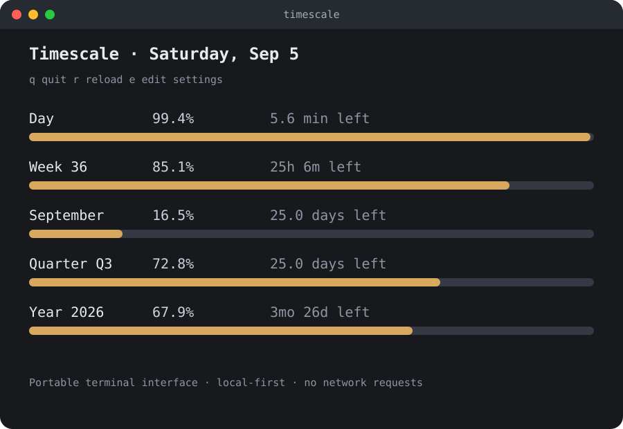

<p align="center">
  
</p>

<h1 align="center">Timescale</h1>

<p align="center">
  <a href="https://github.com/davafons/timescale/releases/latest"></a>
  <a href="https://github.com/davafons/timescale/actions/workflows/ci.yml"></a>
  <a href="https://github.com/davafons/timescale/blob/main/LICENSE"></a>
  <a href="https://github.com/davafons/timescale/releases"></a>
</p>

**See your time at a glance.** Timescale turns the day, week, month, quarter, year, and an estimated lifetime into quiet progress bars. Use the native macOS menu-bar app or the portable terminal interface on macOS, Linux, and Windows.

No account, analytics, or runtime network requests. Just a useful glance at the menu bar or terminal.

| macOS menu-bar app | Terminal TUI |
| --- | --- |
|  |  |

## What it shows

- **Waking day** — choose when your day starts and ends instead of counting sleep as usable time.
- **One-click routine** — start a named duration such as an eight-hour workday and follow its persistent progress bar.
- **Sunlight** — see sunrise and sunset within that same waking-day timeline.
- **Week, month, quarter, and year** — elapsed percentage, time remaining, and what one percent means in human units.
- **Calendar or Japan fiscal quarters** — choose Jan–Dec numbering or Japan's Apr–Mar fiscal year.
- **Birthday marker** — locate your birthday in the current year.
- **Life estimate** — compare your current age with an editable population-average lifespan.
- **Native menu-bar percentage** — today's waking-day progress stays visible without opening anything.
- **Portable TUI and CLI** — interactive bars, plain output, JSON, and Waybar integration from one small binary.
- **Shared settings** — the Mac app and TUI use the same versioned configuration on macOS.

The TUI uses solid block bars, a thin sunlight strip, a continuous sand-fill activity indicator, and slow uniform color pulses across active time. Set `tui.motion` to `reduced` or `off` when preferred. Terminal-default, Catppuccin, Tokyo Night, Gruvbox, and monochrome palettes are built in.

## Requirements

- Native app: macOS 14 Sonoma or later, on Apple Silicon or Intel
- TUI binary: macOS, Linux, or Windows
- Building from source: Swift 6 for the native app and Rust 1.88 for the TUI

The native interface remains AppKit and SwiftUI. The portable frontend is Rust with Ratatui and Crossterm.

## Install

### From a release

Download the latest `.dmg` from [GitHub Releases](https://github.com/davafons/timescale/releases/latest), open it, and drag **Timescale** into **Applications**. Launch it with Spotlight; the hourglass and today's percentage will appear in the menu bar.

For the TUI, download the archive matching your platform and place `timescale` (or `timescale.exe`) on your `PATH`. On macOS and Linux, the installer can do that for you:

```sh
curl -fsSL https://raw.githubusercontent.com/davafons/timescale/main/scripts/install-tui.sh | sh
```

The installer places the binary at `~/.local/bin/timescale`. If `timescale` is not found afterward, add that directory to your shell `PATH`:

```sh
export PATH="$HOME/.local/bin:$PATH"
```

On Windows, download the `windows-x86_64` release archive, extract `timescale.exe`, and add its directory to `PATH`.

Development builds are ad-hoc signed and macOS may ask you to confirm their first launch. Official binary releases should be Developer ID signed and notarized.

### From source

Clone the repository, then build either frontend:

```sh
git clone https://github.com/davafons/timescale.git
cd timescale
make install
cargo build --release --locked --bin timescale
make install-tui
```

To remove the application while keeping its preferences:

```sh
make uninstall
```

To erase preferences too:

```sh
defaults delete com.davafons.timescale
```

The shared JSON file is separate; its location is described below.

## Terminal interface

Running `timescale` opens the live TUI. It refreshes progress and shared settings automatically. Press `e` to open the built-in settings screen; changes are validated and saved immediately to the same configuration used by the macOS app.

- `↑`/`↓` or `j`/`k`: move through settings
- `←`/`→` or Space: change a toggle, choice, time, or number
- Enter: open a searchable picker or edit an exact value, then validate and save
- `g` on Location: request current coordinates through the native macOS app
- `w` on the dashboard: start, stop, or restart the configured routine
- Escape: cancel an edit or return to the dashboard
- `q`: quit from either screen

The settings list follows the native app's order—visible progress, waking day, routine, sun, life estimate, and appearance—with terminal-only preferences last. It scrolls automatically in smaller terminals. Countries and other fixed choices use filtered pickers; numeric editors contain only the value, while units remain presentation text. On macOS, current-location requests are handed to the native app's Core Location flow and arrive through the shared configuration. Other platforms retain offline coordinate entry rather than contacting an IP-geolocation service. `timescale config edit` remains available for advanced direct JSON editing.

```sh
timescale
timescale status
timescale status --json
timescale status --waybar
timescale config path
timescale config show
timescale config edit
timescale config set day.start 07:30
timescale config set quarter.cycle japanFiscal
timescale config set tui.theme tokyoNight
timescale config set tui.motion reduced
timescale doctor
```

`status --json` is the stable integration surface for plugins and scripts. `status --waybar` emits Waybar custom-module JSON.

## Agent skill

A platform-neutral agent skill lives at [`skills/timescale/SKILL.md`](skills/timescale/SKILL.md). It teaches shell-capable agents to use the JSON interface for time-aware planning and to change settings only when explicitly requested. It contains no Codex plugin metadata and is not installed automatically, so the folder can be copied or linked into any agent runtime that supports Markdown-based skills, including a future Hermes setup.

## Shared configuration

Settings follow [`config/timescale.schema.json`](config/timescale.schema.json) and are replaced through a same-directory temporary file with user-only permissions. Default locations are:

- macOS: `~/Library/Application Support/Timescale/config.json`
- Linux: `${XDG_CONFIG_HOME:-~/.config}/timescale/config.json`
- Windows: `%APPDATA%\Timescale\config.json`

Set `TIMESCALE_CONFIG` or pass `--config PATH` to use another location. On macOS, the native app imports existing `UserDefaults` into this file, keeps its SwiftUI controls synchronized with external TUI edits, and preserves TUI-only appearance settings.

## Omarchy and Waybar

From a checkout on Omarchy:

```sh
make install-omarchy
```

For a released binary, run `scripts/install-omarchy.sh`. It installs the TUI and icon, then uses Omarchy's native `omarchy-tui-install` command to register Timescale as a floating application.

An optional Waybar custom-module definition and styles live in [`packaging/waybar`](packaging/waybar). Merge the module into your Waybar configuration and add `custom/timescale` to the desired module list. Clicking it launches or focuses the Timescale TUI.

## Privacy

Timescale works offline. It requests approximate location only after you press **Use Current Location**, then saves the coordinates locally to calculate sunrise and sunset. It does not retain location history or transmit data.

Solar times are an offline astronomical approximation. They may differ slightly from official sources, especially near polar regions; saved coordinates are assumed to use the Mac's current time zone.

Birth date, country, life expectancy, waking hours, routine start time, approximate coordinates, and appearance preferences are stored unencrypted in local settings. The native app mirrors shared values between macOS `UserDefaults` and the JSON configuration. The life bar is a visualization of an editable population average—not a medical or personal prediction.

Country defaults are rounded from the World Bank's 2024 [life expectancy at birth](https://data.worldbank.org/indicator/SP.DYN.LE00.IN) dataset (CC BY 4.0).

## Development

```sh
make dev       # rebuild, reinstall, and relaunch when files change
make format    # format Swift and Rust sources
make lint      # Swift format, ShellCheck, rustfmt, and Clippy
make test      # run Swift and Rust tests
make build     # create build/Timescale.app
make tui       # create the optimized portable binary
make package   # create a universal DMG, ZIP, and checksums in dist/
make package-tui # create a universal macOS TUI archive
```

The macOS development loop is rebuild-and-relaunch rather than in-process hot reload. The Rust workspace keeps Ratatui and Crossterm defaults disabled and uses TachyonFX for cell-level motion. TachyonFX's runtime DSL is disabled; the rotating Braille sandglass, argument parsing, config paths, and safe file replacement remain local. There is no `ttfx`, CLI-parser, spinner framework, or platform-directory dependency. Release builds use size optimization, LTO, symbol stripping, and abort-on-panic.

### Release signing and notarization

`make package` creates an ad-hoc signed universal app by default. For a public build, provide a Developer ID identity:

```sh
CODE_SIGN_IDENTITY='Developer ID Application: Your Name (TEAMID)' make package
```

To notarize the DMG, save credentials with `xcrun notarytool store-credentials`, then set `NOTARY_PROFILE` while packaging.

GitHub Releases are the distribution channel for published builds. Update `CFBundleShortVersionString` in `Resources/Info.plist` and the Cargo workspace version, then push the matching semantic-version tag. The release workflow creates the universal native app plus TUI archives for universal macOS, Linux x86-64, Linux ARM64, and Windows x86-64, verifies them, and publishes one checksum manifest. Developer ID and notarization secrets are optional; the native app falls back to an ad-hoc signature when absent.

## Design principles

- Native AppKit and SwiftUI, with no embedded browser
- One portable terminal binary with scriptable output
- Useful in one click and invisible when closed
- Calendar-aware calculations and configurable waking hours
- Local-first, dependency-conscious, and small

## Contributing

Bug reports and focused pull requests are welcome. Run `make lint test` before submitting a change. Date-logic changes should include coverage for time zones, daylight-saving transitions, and calendar boundaries in both cores.

## License

Timescale is available under the [MIT License](LICENSE).
