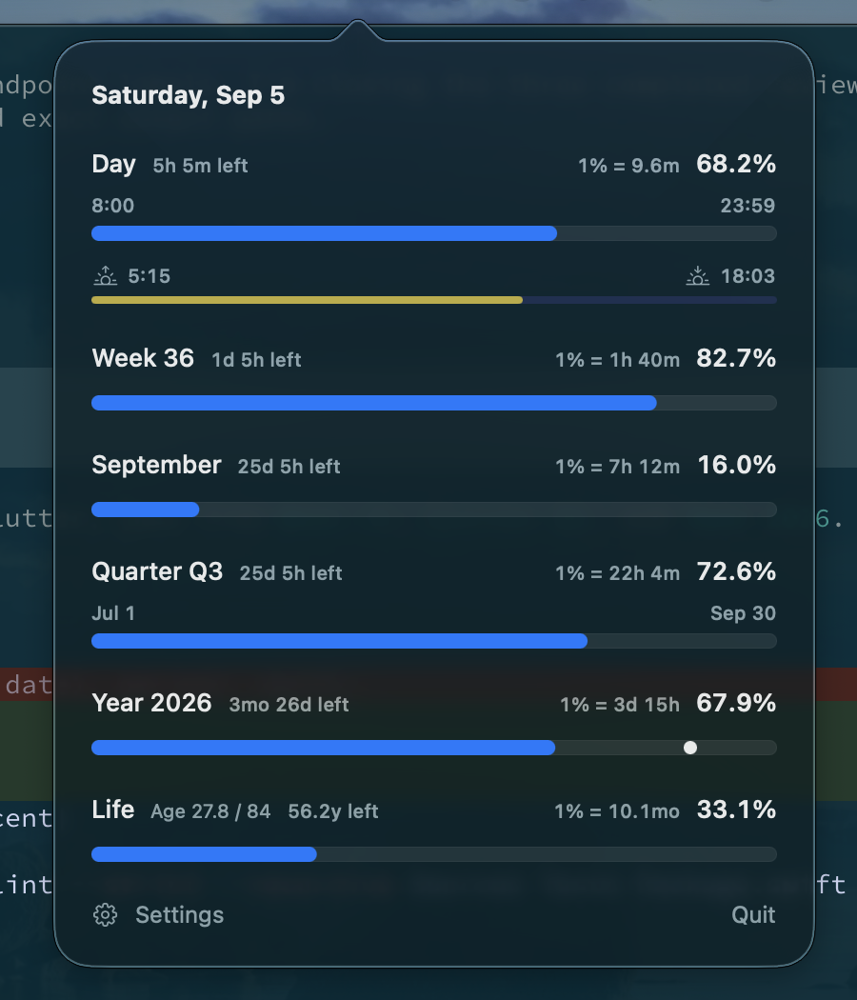

# Timescale

**See your time at a glance.** Timescale is a small, private, native macOS menu-bar app that turns the day, week, month, quarter, year, and an estimated lifetime into quiet progress bars.

No account. No analytics. No network requests. No Dock icon. Just a useful glance at the menu bar.



## What it shows

- **Waking day** — choose when your day starts and ends instead of counting sleep as usable time.
- **Sunlight** — see sunrise and sunset within that same waking-day timeline.
- **Week, month, quarter, and year** — elapsed percentage, time remaining, and what one percent means in human units.
- **Calendar or Japan fiscal quarters** — choose Jan–Dec numbering or Japan's Apr–Mar fiscal year.
- **Birthday marker** — locate your birthday in the current year.
- **Life estimate** — compare your current age with an editable population-average lifespan.
- **Menu-bar percentage** — today's waking-day progress stays visible without opening anything.

Everything is customizable from a small native Settings window.

## Requirements

- macOS 14 Sonoma or later
- Apple Silicon or Intel Mac

The interface is currently macOS-only. The calculations are separated into the reusable `TimescaleCore` Swift target.

## Install

### From a release

Download the latest `.dmg` from [GitHub Releases](https://github.com/davafons/timescale/releases/latest), open it, and drag **Timescale** into **Applications**. Launch it with Spotlight; the hourglass and today's percentage will appear in the menu bar.

Development builds are ad-hoc signed and macOS may ask you to confirm their first launch. Official binary releases should be Developer ID signed and notarized.

### From source

Install Xcode Command Line Tools and Swift 6, then:

```sh
git clone https://github.com/davafons/timescale.git
cd timescale
make install
```

To remove the application while keeping its preferences:

```sh
make uninstall
```

To erase preferences too:

```sh
defaults delete com.davafons.timescale
```

## Privacy

Timescale works offline. It requests approximate location only after you press **Use Current Location**, then saves the coordinates locally to calculate sunrise and sunset. It does not retain location history or transmit data.

Solar times are an offline astronomical approximation. They may differ slightly from official sources, especially near polar regions; saved coordinates are assumed to use the Mac's current time zone.

Birth date, country, life expectancy, waking hours, approximate coordinates, and appearance preferences are stored unencrypted in macOS `UserDefaults`. The life bar is a visualization of an editable population average—not a medical or personal prediction.

Country defaults are rounded from the World Bank's 2024 [life expectancy at birth](https://data.worldbank.org/indicator/SP.DYN.LE00.IN) dataset (CC BY 4.0).

## Development

```sh
make dev       # rebuild, reinstall, and relaunch when files change
make format    # format Swift sources in place
make lint      # check Swift formatting and shell scripts
make test      # run calculation tests
make build     # create build/Timescale.app
make package   # create a universal DMG, ZIP, and checksums in dist/
```

The development loop is rebuild-and-relaunch rather than in-process hot reload. The project has no third-party runtime dependencies.

### Release signing and notarization

`make package` creates an ad-hoc signed universal app by default. For a public build, provide a Developer ID identity:

```sh
CODE_SIGN_IDENTITY='Developer ID Application: Your Name (TEAMID)' make package
```

To notarize the DMG, save credentials with `xcrun notarytool store-credentials`, then set `NOTARY_PROFILE` while packaging.

GitHub Releases are the distribution channel for published builds. Update `CFBundleShortVersionString` in `Resources/Info.plist`, then push the matching semantic-version tag, such as `v0.1.0`. The release workflow tests the app, creates a universal DMG and ZIP, verifies their checksums, and attaches them to a GitHub Release. The workflow supports Developer ID and notarization secrets, but falls back to an ad-hoc signature when they are absent.

## Design principles

- Native AppKit and SwiftUI, with no embedded browser
- Useful in one click and invisible when closed
- Calendar-aware calculations and configurable waking hours
- Local-first, dependency-free, and small

## Contributing

Bug reports and focused pull requests are welcome. Run `swift test` before submitting a change. Date-logic changes should include coverage for time zones, daylight-saving transitions, and calendar boundaries.

## License

Timescale is available under the [MIT License](LICENSE).
